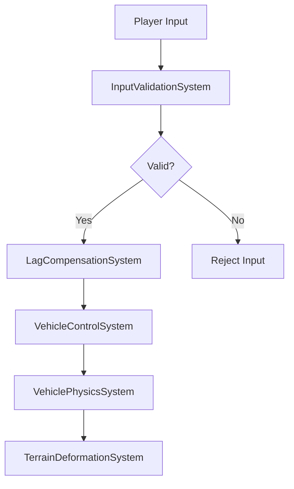
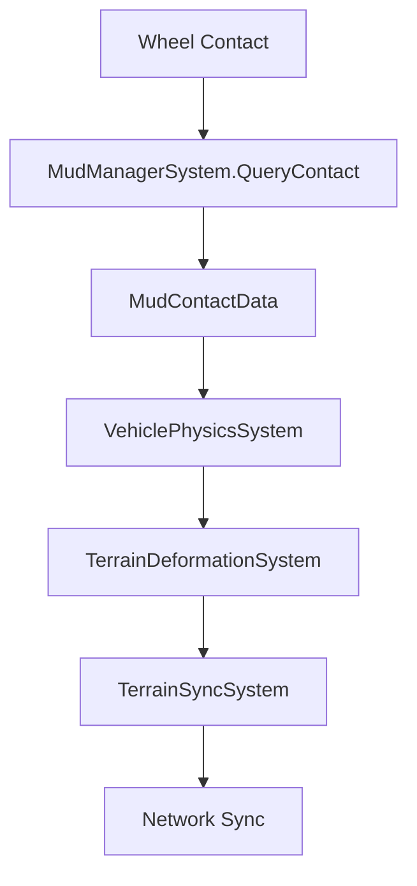
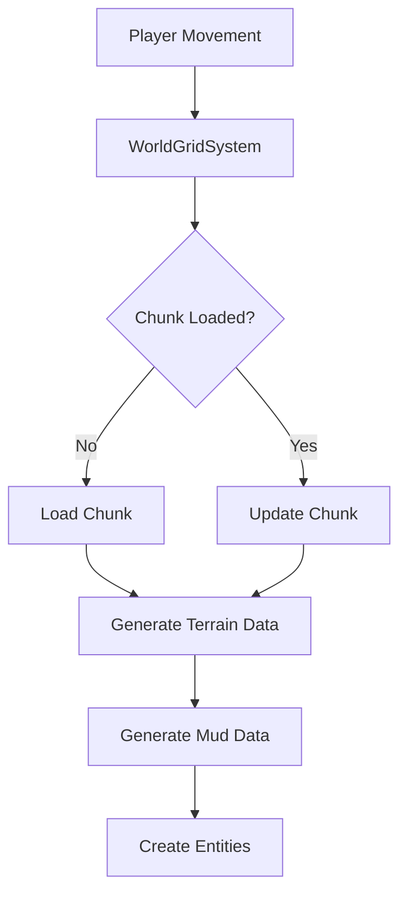

# 🏗️ Mud-Like Systems Integration Architecture

## 📋 **ОБЗОР АРХИТЕКТУРЫ**

Документ описывает интеграцию критических систем проекта Mud-Like, их взаимодействие и поток данных. Архитектура основана на ECS (Entity Component System) с использованием Unity DOTS и Netcode for Entities.

## 🎯 **КРИТИЧЕСКИЕ СИСТЕМЫ**

### **1. Террейн и деформация**
- **MudManagerSystem** - API деформации террейна
- **TerrainDeformationSystem** - система деформации
- **TerrainSyncSystem** - синхронизация террейна
- **WorldGridSystem** - управление загрузкой чанков

### **2. Мультиплеер и сеть**
- **InputValidationSystem** - валидация ввода
- **LagCompensationSystem** - компенсация задержек
- **NetworkManagerSystem** - управление сетью
- **NetworkSyncSystem** - синхронизация состояния

### **3. Физика и транспорт**
- **VehiclePhysicsSystem** - физика транспорта
- **VehicleControlSystem** - управление транспортом игрока
- **RealisticWheelPhysicsSystem** - реалистичная физика колес

### **4. Производительность и оптимизация**
- **MudParticlePoolSystem** - пулинг частиц
- **ObjectPoolSystem** - общий пулинг объектов
- **SystemPerformanceProfiler** - профилирование систем

## 🔄 **ПОТОК ДАННЫХ**

### **1. Ввод игрока → Валидация → Применение**



**Реальный код потока:**
```csharp
// 1. Получение ввода от клиента
var input = new PlayerInput { Movement = new float2(0.5f, 0.3f) };

// 2. Валидация ввода
var validationSystem = SystemAPI.GetSingleton<InputValidationSystem>();
var validationResult = validationSystem.ValidatePlayerInput(playerId, input, timestamp);

if (validationResult.IsValid)
{
    // 3. Компенсация задержек
    var lagCompensation = SystemAPI.GetSingleton<LagCompensationSystem>();
    var compensatedPosition = lagCompensation.CompensateMovement(playerId, timestamp, targetPosition);
    
    // 4. Применение управления транспортом
    var vehicleControl = SystemAPI.GetSingleton<VehicleControlSystem>();
    vehicleControl.ProcessVehicleControl(ref transform, input, ref physics, deltaTime);
}
```

### **2. Взаимодействие с грязью → Деформация → Синхронизация**



**Реальный код потока:**
```csharp
// 1. Взаимодействие колеса с грязью
var mudManager = SystemAPI.GetSingleton<MudManagerSystem>();
var contactData = mudManager.QueryContact(wheelPosition, wheelRadius, wheelForce);

// 2. Применение результатов к физике
if (contactData.IsValid)
{
    wheelPhysics.Traction *= contactData.TractionModifier;
    wheelPhysics.Drag += contactData.Drag;
    wheelPhysics.SinkDepth = contactData.SinkDepth;
}

// 3. Создание деформации террейна
var deformationData = new DeformationData
{
    Position = wheelPosition,
    Radius = wheelRadius,
    Depth = contactData.SinkDepth,
    Force = wheelForce
};

// 4. Синхронизация деформации
var terrainSync = SystemAPI.GetSingleton<TerrainSyncSystem>();
terrainSync.SyncTerrainDeformation(deformationData, isAuthoritative);
```

### **3. Загрузка террейна → WorldGrid → Генерация**



**Реальный код потока:**
```csharp
// 1. Проверка необходимости обновления сетки
var worldGrid = SystemAPI.GetSingleton<WorldGridSystem>();
if (worldGrid.ShouldUpdateGrid(playerPosition))
{
    // 2. Обновление чанков
    worldGrid.UpdateGridChunks(playerPosition);
    
    // 3. Загрузка новых чанков
    worldGrid.LoadPendingChunks();
    
    // 4. Выгрузка ненужных чанков
    worldGrid.UnloadPendingChunks();
}
```

## 🔧 **ИНТЕГРАЦИЯ СИСТЕМ**

### **1. MudManagerSystem ↔ VehiclePhysicsSystem**

**MudManagerSystem предоставляет API:**
```csharp
public MudContactData QueryContact(float3 wheelPosition, float radius, float wheelForce)
{
    // Получаем данные террейна
    var terrainData = GetTerrainDataAtPosition(wheelPosition);
    
    // Вычисляем уровень грязи
    float mudLevel = CalculateMudLevel(wheelPosition, radius, terrainData);
    
    // Вычисляем глубину погружения
    float sinkDepth = CalculateSinkDepth(wheelPosition, radius, wheelForce, mudLevel, terrainData);
    
    // Вычисляем модификатор тяги
    float tractionModifier = CalculateTractionModifier(sinkDepth, mudLevel, terrainData);
    
    return new MudContactData
    {
        Position = wheelPosition,
        MudLevel = mudLevel,
        SinkDepth = sinkDepth,
        TractionModifier = tractionModifier,
        IsValid = true
    };
}
```

**VehiclePhysicsSystem использует API:**
```csharp
protected override void OnUpdate()
{
    Entities
        .WithAll<VehicleTag>()
        .ForEach((ref VehiclePhysics physics, in LocalTransform transform) =>
        {
            // Получаем данные контакта с грязью
            var mudManager = SystemAPI.GetSingleton<MudManagerSystem>();
            var contactData = mudManager.QueryContact(transform.Position, physics.WheelRadius, physics.WheelForce);
            
            if (contactData.IsValid)
            {
                // Применяем модификаторы
                physics.Traction *= contactData.TractionModifier;
                physics.Drag += contactData.Drag;
                physics.SinkDepth = contactData.SinkDepth;
            }
        }).Schedule();
}
```

### **2. InputValidationSystem ↔ NetworkManagerSystem**

**NetworkManagerSystem получает ввод:**
```csharp
public void OnClientInputReceived(int clientId, PlayerInput input, float timestamp)
{
    // Валидация ввода
    var validationSystem = SystemAPI.GetSingleton<InputValidationSystem>();
    var result = validationSystem.ValidatePlayerInput(clientId, input, timestamp);
    
    if (result.IsValid)
    {
        // Применяем ввод
        ApplyValidatedInput(clientId, input);
    }
    else
    {
        // Обрабатываем невалидный ввод
        HandleInvalidInput(clientId, result);
    }
}
```

**InputValidationSystem валидирует:**
```csharp
public ValidationResult ValidatePlayerInput(int playerId, PlayerInput input, float timestamp)
{
    var result = new ValidationResult { IsValid = true };
    
    // 1. Проверка частоты ввода
    if (!ValidateInputRate(playerId, timestamp, ref result))
        return result;
    
    // 2. Проверка корректности значений
    if (!ValidateInputValues(input, ref result))
        return result;
    
    // 3. Проверка физической возможности
    if (!ValidatePhysicalPossibility(playerId, input, ref result))
        return result;
    
    // 4. Проверка на подозрительную активность
    if (!ValidateBehavioralPatterns(playerId, input, ref result))
        return result;
    
    return result;
}
```

### **3. LagCompensationSystem ↔ TerrainSyncSystem**

**LagCompensationSystem создает снимки:**
```csharp
public void CreateWorldSnapshot(float timestamp)
{
    var snapshot = new SnapshotData
    {
        Timestamp = timestamp,
        PlayerPositions = new NativeHashMap<int, float3>(64, Allocator.Temp),
        EntityStates = new NativeHashMap<Entity, EntityStateData>(1000, Allocator.Temp)
    };
    
    // Собираем данные всех игроков
    Entities
        .WithAll<PlayerTag, NetworkId>()
        .ForEach((Entity entity, in LocalTransform transform, in NetworkId networkId) =>
        {
            snapshot.PlayerPositions[networkId.Value] = transform.Position;
        }).Schedule();
    
    _worldSnapshots.Add(snapshot);
}
```

**TerrainSyncSystem синхронизирует деформации:**
```csharp
public void SyncTerrainDeformation(DeformationData deformation, bool authoritative)
{
    var syncData = new TerrainSyncData
    {
        Position = deformation.Position,
        Radius = deformation.Radius,
        Depth = deformation.Depth,
        Force = deformation.Force,
        Timestamp = SystemAPI.Time.time,
        IsAuthoritative = authoritative,
        NeedsSync = true
    };
    
    _pendingUpdates.Add(new TerrainUpdate { SyncData = syncData });
}
```

## ⚡ **ПРОИЗВОДИТЕЛЬНОСТЬ И ОПТИМИЗАЦИЯ**

### **1. Burst Compiler интеграция**
Все критические системы используют Burst Compiler:

```csharp
[BurstCompile]
public partial class MudManagerSystem : SystemBase
{
    [BurstCompile]
    public MudContactData QueryContact(float3 wheelPosition, float radius, float wheelForce)
    {
        // Оптимизированный код
    }
}

[BurstCompile]
public partial class InputValidationSystem : SystemBase
{
    [BurstCompile]
    public ValidationResult ValidatePlayerInput(int playerId, PlayerInput input, float timestamp)
    {
        // Оптимизированный код
    }
}
```

### **2. Job System интеграция**
Системы используют Job System для параллельности:

```csharp
protected override void OnUpdate()
{
    Entities
        .WithAll<PlayerTag>()
        .ForEach((ref LocalTransform transform, in PlayerInput input) =>
        {
            ProcessMovement(ref transform, input, deltaTime);
        }).Schedule(); // Параллельное выполнение
}
```

### **3. Native Collections**
Эффективное управление памятью:

```csharp
private NativeHashMap<int, MudContactData> _mudContacts;
private NativeList<TerrainUpdate> _pendingUpdates;
private NativeHashMap<int, PlayerValidationData> _playerValidationData;
```

## 🧪 **ТЕСТИРОВАНИЕ ИНТЕГРАЦИИ**

### **1. Integration тесты**
```csharp
[Test]
public void MudManager_VehiclePhysics_Integration_WorksCorrectly()
{
    // Arrange
    var mudManager = new MudManagerSystem();
    var vehiclePhysics = new VehiclePhysicsSystem();
    
    // Act
    var contactData = mudManager.QueryContact(wheelPosition, wheelRadius, wheelForce);
    vehiclePhysics.ApplyMudContact(contactData);
    
    // Assert
    Assert.IsTrue(contactData.IsValid);
    Assert.Greater(vehiclePhysics.Traction, 0f);
}

[Test]
public void InputValidation_NetworkManager_Integration_ValidatesInput()
{
    // Тест интеграции валидации ввода с сетевым менеджером
}
```

### **2. Performance тесты**
```csharp
[Test]
public void MudManager_QueryContact_Performance_UnderLimit()
{
    // Тест производительности API QueryContact
    var mudManager = new MudManagerSystem();
    var stopwatch = Stopwatch.StartNew();
    
    for (int i = 0; i < 1000; i++)
    {
        var result = mudManager.QueryContact(wheelPosition, wheelRadius, wheelForce);
    }
    
    stopwatch.Stop();
    Assert.Less(stopwatch.ElapsedMilliseconds, 100); // Менее 100ms для 1000 вызовов
}
```

## 📊 **МЕТРИКИ И МОНИТОРИНГ**

### **1. Производительность систем**
```csharp
public struct SystemPerformanceMetrics
{
    public float UpdateTime;           // Время обновления системы
    public int ProcessedEntities;      // Количество обработанных сущностей
    public float MemoryUsage;          // Использование памяти
    public int JobCount;               // Количество выполняемых Job'ов
}
```

### **2. Сетевые метрики**
```csharp
public struct NetworkMetrics
{
    public float AveragePing;          // Средний ping
    public int PacketsPerSecond;       // Пакетов в секунду
    public float PacketLoss;           // Потеря пакетов
    public int ValidatedInputs;        // Валидированных вводов
    public int RejectedInputs;         // Отклоненных вводов
}
```

## 🚨 **ВАЖНЫЕ ПРИНЦИПЫ**

### **1. Детерминизм**
- Все системы используют `SystemAPI.Time.fixedDeltaTime`
- Нет использования `Time.deltaTime` в игровой логике
- Все расчеты детерминированы для мультиплеера

### **2. Производительность**
- Burst Compiler для всех критических методов
- Job System для параллельности
- Native Collections для эффективности памяти

### **3. Безопасность**
- Серверная валидация всех действий
- Защита от читов и мошенничества
- Авторитетная архитектура (сервер - источник истины)

## 📚 **СВЯЗАННАЯ ДОКУМЕНТАЦИЯ**

- [MudManagerSystem.md](./Assets/Scripts/Terrain/Systems/MudManagerSystem.md) - API деформации террейна
- [InputValidationSystem.md](./Assets/Scripts/Networking/Systems/InputValidationSystem.md) - Валидация ввода
- [LagCompensationSystem.md](./Assets/Scripts/Networking/Systems/LagCompensationSystem.md) - Компенсация задержек
- [WorldGridSystem.md](./Assets/Scripts/Terrain/Systems/WorldGridSystem.md) - Управление загрузкой
- [MudParticlePoolSystem.md](./Assets/Scripts/Pooling/Systems/MudParticlePoolSystem.md) - Пулинг частиц
